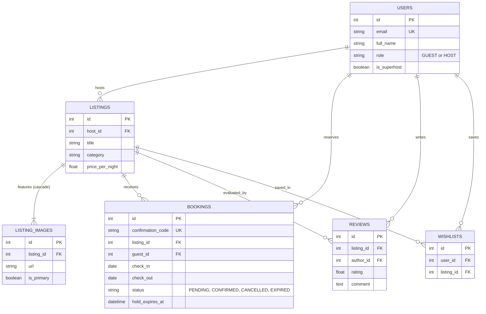

# Airbnb Clone — Final Master Layer-by-Layer Product Architecture

> **Document Status:** Final & Approved Architecture  
> **Source Directives:** `Assignment Airbnb Clone.docx` + Live Reverse-Engineered Specifications  
> **Target Stack:** Next.js 14+ (TypeScript) + FastAPI (Python 3.13) + SQLite (`airbnb.db`)

---

## High-Level System Architecture Diagram

```mermaid
graph TD
    subgraph Layer1 ["Layer 1: Presentation & UI/UX Layer (Next.js 14 + TypeScript)"]
        Nav["Global Nav & Search Pill (Where · When · Who)"]
        Explore["Explore Grid, Category Carousel & Leaflet Map Split"]
        Detail["Listing Detail: 5-Photo Mosaic, Booking Widget, Reviews Matrix"]
        Checkout["Checkout Flow: 15-Min Live Hold Countdown & Mock Pay"]
        Trips["My Trips (/trips): Active Reservations & Instant Cancellation"]
        HostUI["Host Dashboard (/hosting): Stats, Listings CRUD, Guest Reservations"]
        WishlistUI["Wishlists (/wishlists): Saved Favorites Grid"]
        PersonaUI["Reviewer 1-Click Persona Switcher: Lakshya (Guest) ↔ Sarah (Host)"]
    end

    subgraph Layer2 ["Layer 2: API Gateway & Controller Layer (FastAPI)"]
        CORS["CORS Middleware (Allow Next.js localhost:3000)"]
        StaticServe["Static File Mount (/static/uploads)"]
        OpenAPI["Interactive Swagger UI (/docs) & ReDoc (/redoc)"]
        V1Router["APIRouter: /api/v1 (REST Endpoints)"]
    end

    subgraph Layer3 ["Layer 3: Domain & Business Logic Services"]
        HoldService["2-Phase Date-Hold Booking Engine (15-Min TTL & Lazy Expiry)"]
        CollisionService["Mathematical Collision Invariant Check: (req_in < booked_out) && (req_out > booked_in)"]
        PricingService["Dynamic Server-Side Pricing & Fees Calculation Service"]
        SearchService["Multi-Facet Search & Category Filtering Engine"]
        HostService["Host Property Lifecycle & CRUD Service"]
    end

    subgraph Layer4 ["Layer 4: Data Access & ORM Layer (SQLAlchemy 2.0)"]
        TypedModels["Declarative Typed ORM Models (Mapped Annotations)"]
        DBSession["FastAPI Scoped Session Dependency (get_db)"]
        SQLitePragmas["Engine Hooks: PRAGMA foreign_keys=ON, journal_mode=WAL, busy_timeout=5000"]
    end

    subgraph Layer5 ["Layer 5: Persistence & Storage Layer (SQLite Database)"]
        DB[(backend/airbnb.db - 6 Relational Tables)]
        DiskUploads["Local Static Storage (backend/static/uploads/)"]
        Seeder["Automated Database Seeder (seed.py - 16+ Global Properties)"]
    end

    subgraph Layer6 ["Layer 6: Security, Auth & Reviewer Persona Layer"]
        PersonaAuth["1-Click Demo Persona Switcher (Guest: Lakshya / Host: Sarah)"]
        JWTAuth["PyJWT Token Issuance & Passlib Bcrypt Hashing"]
        RBAC["Role-Based Access Control (Guest vs Host Ownership Enforcement)"]
    end

    Layer1 <-->|JSON REST API Requests| Layer2
    Layer2 --> Layer3
    Layer3 --> Layer4
    Layer4 --> Layer5
    Layer2 -.-> Layer6
```



---

## Layer 1: Presentation & UI/UX Layer (Next.js 14 App Router + TypeScript)

### 1.1 Directory & Routing Architecture (`frontend/src/app/`)
- **`app/page.tsx` (Explore / Homepage)**:
  - Sticky Top Nav with Airbnb logo, central Search Pill (`Where · When · Who`), and Persona Switcher.
  - Horizontal scrollable **Category Bar** with 60+ SVG icons (Beachfront, Cabins, Mansions, Trending, Lakefront, etc.) with a 2px active bottom border.
  - Floating **"Filters"** button opening the modal (Price range slider, Property types, Amenities checkboxes).
  - Responsive **Listing Grid**: 4-column (desktop), 3-column (laptop), 2-column (tablet), 1-column (mobile).
  - Listing cards: 4:3 photo carousel, dot pagination, hover chevrons, `"Guest favourite"` badge, location bold, star rating with review count, and price line.
  - Floating pill button toggle: **`Show map 🗺️` / `Show list 📋`** (Leaflet map with custom white price pills).
- **`app/rooms/[id]/page.tsx` (Listing Detail)**:
  - Header: Title (Bold 26px), Superhost badge, star rating, review count, and location.
  - **5-Photo Mosaic Gallery**: 1 large left photo (50% width) + 4 quadrant right photos (50% width), with a `"Show all photos"` modal launcher.
  - Host info card: Avatar, Superhost badge, hosting duration, and hospitality bio.
  - Room specs: Guests, bedrooms, beds, bathrooms, and 2-column amenities icon grid.
  - In-page **Dual-Month Availability Calendar** highlighting booked dates in strikethrough gray.
  - **Sticky Reservation Card**: Segmented inputs (`CHECK-IN`, `CHECKOUT`, `GUESTS`), dynamic cost calculation itemization, and pink Airbnb gradient **"Reserve"** button.
  - **Reviews Matrix**: Overall rating score, 6 dimension category meters (Cleanliness, Accuracy, Communication, Location, Check-in, Value), and 2-column review cards.
- **`app/trips/page.tsx` (My Trips)**:
  - Displays all upcoming, past, and cancelled guest reservations.
  - Cards showing photo, title, location, dates, confirmation code (`HM-XXXXXX`), and total amount paid.
  - **Cancel Reservation** button with instant confirmation modal that immediately unblocks the listing calendar.
- **`app/hosting/page.tsx` (Host Dashboard)**:
  - Sub-tabs: **`Overview`**, **`Listings`**, and **`Reservations`**.
  - Overview: Total active listings, guest reservation count, and projected revenue stats.
  - Listings management: Card/table view with status, nightly price, and instant **Edit** and **Delete** actions.
  - **Create Listing Wizard**: Modal collecting Title, Category, Property Type, Location, Guest capacity, Bedrooms, Price, Cleaning Fee, Amenities, and Photos.
  - Reservations tab: All bookings made by guests across the host's properties.
- **`app/wishlists/page.tsx` (Wishlists)**:
  - Grid of saved favorite properties bookmarked via the heart icon.

### 1.2 Design System Tokens (Extracted from Live Airbnb)
- **Primary Brand Red**: `#FF385C` (`--palette-product-rausch`)
- **Action Button Gradient**:
  ```css
  background: linear-gradient(90deg, #E61E4D 1.83%, #E31C5F 50.07%, #D70466 96.34%);
  ```
- **Text Primary**: `#222222` | **Text Secondary**: `#717171` | **Muted**: `#B0B0B0`
- **Backgrounds**: `#FFFFFF` (Primary), `#F7F7F7` (Secondary/Hover surfaces)
- **Borders & Dividers**: `#DDDDDD` (Card borders/search pill), `#EBEBEB` (Hairline dividers)
- **Card Media Aspect Ratio**: Exactly `1.333` (4:3 ratio).
- **Elevations**:
  - Search pill idle: `box-shadow: 0 1px 2px rgba(0,0,0,0.08), 0 4px 12px rgba(0,0,0,0.05);`
  - Search pill hover: `box-shadow: 0 2px 4px rgba(0,0,0,0.18);`
  - Sticky reserve card: `box-shadow: 0 6px 16px rgba(0,0,0,0.12); border: 1px solid #DDDDDD;`

---

## Layer 2: API Gateway & Controller Layer (FastAPI)

### 2.1 REST Routing Topology (`/api/v1`)
All endpoints are strictly versioned, typed with Pydantic v2 schemas, and documented automatically at `/docs`:

| Group | Method | Endpoint | Function |
| :--- | :--- | :--- | :--- |
| **Auth / Personas** | `GET` | `/api/v1/auth/me` | Return active authenticated user profile |
| | `POST` | `/api/v1/auth/switch-persona` | 1-click toggle between Guest (`Lakshya`) & Host (`Sarah`) |
| | `GET` | `/api/v1/auth/users` | List available evaluation personas |
| **Listings** | `GET` | `/api/v1/listings` | Filtered search (category, city, dates, guests, price, amenities) |
| | `GET` | `/api/v1/listings/{id}` | Full listing detail with images, host info, and booked dates |
| | `GET` | `/api/v1/listings/{id}/availability` | Booked/held date ranges for calendar disabling |
| | `POST` | `/api/v1/listings` | Host: Create new property listing |
| | `PUT` | `/api/v1/listings/{id}` | Host: Edit listing details, pricing, amenities |
| | `DELETE` | `/api/v1/listings/{id}` | Host: Delete listing with cascade cleanup |
| **Bookings & Holds** | `POST` | `/api/v1/bookings/hold` | Initiate atomic 15-minute temporary date hold (`PENDING`) |
| | `POST` | `/api/v1/bookings/{id}/confirm` | Complete mock payment and transition to `CONFIRMED` |
| | `POST` | `/api/v1/bookings/{id}/release` | Release pending hold (user exits checkout modal) |
| | `GET` | `/api/v1/bookings/my-trips` | Return all reservations for the active guest |
| | `PATCH` | `/api/v1/bookings/{id}/cancel` | Cancel booking and immediately unlock dates |
| **Host Dashboard** | `GET` | `/api/v1/host/listings` | Properties owned by the active host |
| | `GET` | `/api/v1/host/reservations` | Incoming guest bookings on host's properties |
| | `GET` | `/api/v1/host/stats` | Summary stats: active listings, bookings count, revenue |
| **Reviews** | `GET` | `/api/v1/reviews/listing/{id}` | Reviews and 6-dimension ratings breakdown |
| | `POST` | `/api/v1/reviews` | Guest submits a review for a completed stay |
| **Wishlists** | `GET` | `/api/v1/wishlists` | Return user's bookmarked properties |
| | `POST` | `/api/v1/wishlists/toggle/{id}` | Add or remove listing from favorites |
| **Upload & Seed** | `POST` | `/api/v1/upload` | Multipart file upload saved to `/backend/static/uploads/` |
| | `POST` | `/api/v1/seed` | Reset and re-seed database with 16+ global listings |

### 2.2 Middlewares & Static Serving
- **CORS Middleware**: Configured for Next.js (`http://localhost:3000`).
- **Static Files Mount**: `app.mount("/static", StaticFiles(directory="static"), name="static")`.

---

## Layer 3: Application & Domain Business Logic Layer

### 3.1 The 2-Phase Date-Hold Booking Engine
Replicating Airbnb's exact real-world reservation hold without adding external Redis/Celery daemons:
1. **Phase 1: Temporary Hold (`POST /api/v1/bookings/hold`)**:
   - Status set to `PENDING`.
   - `hold_expires_at = datetime.utcnow() + timedelta(minutes=15)`.
   - The dates are immediately locked and rendered unavailable to all other users.
2. **Phase 2: Confirmation (`POST /api/v1/bookings/{id}/confirm`)**:
   - Validates `datetime.utcnow() <= hold_expires_at`.
   - Transitions status to `CONFIRMED`.
   - Issues confirmation code (`HM-` + 6 random alphanumeric characters).
3. **Just-In-Time (Lazy) Expiration Algorithm**:
   - When evaluating availability, any booking where:
     $$\text{status} = \text{'PENDING'} \land \text{hold\_expires\_at} \le \text{CURRENT\_TIMESTAMP}$$
     is mathematically treated as **free/available** and lazily updated to `EXPIRED`.

### 3.2 Mathematical Collision Invariant Check
For any requested stay $[C_{in}, C_{out}]$, an inventory conflict exists if and only if:
$$(C_{in} < B_{out}) \land (C_{out} > B_{in})$$
for any booking $B$ where $(B.\text{status} = \text{'CONFIRMED'})$ OR $(B.\text{status} = \text{'PENDING'} \land B.\text{hold\_expires\_at} > \text{CURRENT\_TIMESTAMP})$.
- **Same-Day Turnover Rule**: If guest A checks out on Oct 10 and guest B checks in on Oct 10, $(10 < 10)$ is **False**, permitting seamless check-in/out on the same day.

### 3.3 Dynamic Pricing & Fee Calculation Engine
All pricing calculations are performed strictly server-side:
$$\text{Nights} = (\text{check\_out} - \text{check\_in}).\text{days}$$
$$\text{Nightly Subtotal} = \text{listing.price\_per\_night} \times \text{Nights}$$
$$\text{Cleaning Fee} = \text{listing.cleaning\_fee}$$
$$\text{Service Fee} = \text{round}(\text{Nightly Subtotal} \times 0.14, 2) \quad (\approx 14\% \text{ standard fee})$$
$$\mathbf{Total\ Price} = \text{Nightly Subtotal} + \text{Cleaning Fee} + \text{Service Fee}$$

---

## Layer 4: Data Access & ORM Layer (SQLAlchemy 2.0)

### 4.1 SQLite Engine Configuration & Concurrency Hooks
```python
# backend/app/db/session.py
from sqlalchemy import create_engine, event
from sqlalchemy.orm import sessionmaker

engine = create_engine(
    "sqlite:///./airbnb.db",
    connect_args={"check_same_thread": False},
    echo=False
)

@event.listens_for(engine, "connect")
def configure_sqlite_pragmas(dbapi_connection, connection_record):
    cursor = dbapi_connection.cursor()
    cursor.execute("PRAGMA foreign_keys=ON")       # Enforce relational integrity & cascades
    cursor.execute("PRAGMA journal_mode=WAL")     # Write-Ahead Logging for multi-reader concurrency
    cursor.execute("PRAGMA busy_timeout=5000")    # 5s wait on concurrent locks
    cursor.close()

SessionLocal = sessionmaker(autocommit=False, autoflush=False, bind=engine)
```

---

## Layer 5: Persistence & Database Schema (SQLite)

Exactly **6 normalized relational tables** covering 100% of assignment criteria:



### Table Schema Summary
1. **`users`**: `id` (PK), `email` (UK), `hashed_password`, `full_name`, `avatar_url`, `role` (`GUEST` / `HOST`), `is_superhost`, `host_since`, `bio`, `created_at`.
2. **`listings`**: `id` (PK), `host_id` (FK $\rightarrow$ `users.id`), `title`, `description`, `property_type`, `category`, `city`, `country`, `latitude`, `longitude`, `price_per_night`, `cleaning_fee`, `service_fee_percent`, `max_guests`, `bedrooms`, `beds`, `bathrooms`, `amenities_json`, `rating`, `review_count`, `is_published`, `created_at`.
3. **`listing_images`**: `id` (PK), `listing_id` (FK $\rightarrow$ `listings.id`, ON DELETE CASCADE), `url`, `caption`, `display_order`, `is_primary`.
4. **`bookings`**: `id` (PK), `confirmation_code` (UK), `listing_id` (FK $\rightarrow$ `listings.id`), `guest_id` (FK $\rightarrow$ `users.id`), `check_in`, `check_out`, `guests_count`, `nightly_rate`, `total_nights`, `cleaning_fee`, `service_fee`, `total_price`, `status` (`PENDING`, `CONFIRMED`, `CANCELLED`, `EXPIRED`), `hold_expires_at`, `created_at`.
5. **`reviews`**: `id` (PK), `listing_id` (FK $\rightarrow$ `listings.id`), `author_id` (FK $\rightarrow$ `users.id`), `rating`, `cleanliness_rating`, `accuracy_rating`, `checkin_rating`, `communication_rating`, `location_rating`, `value_rating`, `comment`, `created_at`.
6. **`wishlists`**: `id` (PK), `user_id` (FK $\rightarrow$ `users.id`), `listing_id` (FK $\rightarrow$ `listings.id`), Unique `(user_id, listing_id)`.

---

## Layer 6: Security, Auth & Reviewer Persona Layer

### 6.1 Dual-Layer Authentication
1. **1-Click Reviewer Persona Switcher**:
   - Header control allowing instant evaluation switching between:
     - 👤 **Guest Persona (`Lakshya`)**: Test browsing, searching, 15-minute date-hold checkout, viewing "My Trips", and wishlists.
     - 🏠 **Host Persona (`Sarah`)**: Test host portal (`/hosting`), creating new listings, in-place edits, deletions, and viewing guest reservations.
2. **Production JWT & Bcrypt Auth**:
   - `POST /api/v1/auth/login` and `POST /api/v1/auth/register` with Bcrypt password hashing and signed JWT bearer tokens for standard auth flows.

### 6.2 Role-Based Access Control (RBAC)
- Only the host who owns a listing (`listing.host_id == current_user.id`) can edit or delete that listing.
- Guests can only cancel their own reservations (`booking.guest_id == current_user.id`).
- Deleting a listing cascades safely to photos, reviews, and wishlists, while protecting active bookings.

---

## Layer 7: Scalability & Production Evolution Roadmap

| Scale Tier | Architecture Implementation | Transition Complexity |
| :--- | :--- | :--- |
| **Phase 1: Current (Assignment & Demo)** | **FastAPI + SQLite (WAL mode) + Next.js App Router** | Zero configuration; runs locally and self-contained |
| **Phase 2: 10K+ Users (Managed Cloud)** | **PostgreSQL Cluster + AWS S3 File Storage** | Change 1 line in `.env` (`DATABASE_URL`). Zero ORM code rewrite. |
| **Phase 3: 100K+ Users (High Concurrency)** | **Redis Distributed Locks (Redlock) + Next.js ISR** | Sub-millisecond atomic date holds; listing pages pre-cached at CDN edge |
| **Phase 4: 1M+ Users (Global Marketplace)** | **Elasticsearch / Typesense + Kubernetes Pod Autoscaling** | Sub-50ms geo-radius queries; auto-scaling stateless FastAPI pods |

---

## Repository Directory Layout

```text
airbnb/
├── frontend/                     # Next.js 14 App Router + TypeScript
│   ├── src/
│   │   ├── app/                  # /, /rooms/[id], /trips, /hosting, /wishlists
│   │   ├── components/           # Nav, SearchModal, Carousel, Mosaic, BookingWidget, HostCRUD
│   │   ├── context/              # AuthPersonaContext.tsx
│   │   ├── lib/                  # Typed API client, dateUtils, currency formatters
│   │   └── styles/               # globals.css with exact Airbnb tokens
│   ├── package.json
│   └── tsconfig.json
│
├── backend/                      # Python FastAPI + SQLite
│   ├── app/
│   │   ├── api/v1/endpoints/     # auth, listings, bookings, host, reviews, wishlists, upload
│   │   ├── core/                 # config.py, security.py
│   │   ├── db/                   # session.py (WAL mode), base.py
│   │   ├── models/               # 6 SQLAlchemy relational models
│   │   ├── schemas/              # Pydantic v2 schemas
│   │   ├── services/             # collision_service, hold_service, pricing_service
│   │   └── main.py               # FastAPI app, CORS, static mounts
│   ├── static/uploads/           # Local file uploads
│   ├── airbnb.db                 # SQLite database file
│   ├── seed.py                   # Realistic database seeder (16+ global properties)
│   └── requirements.txt
│
├── Assignment Airbnb Clone.docx  # Source assignment document
├── FINAL_PRODUCT_ARCHITECTURE.md # Master architectural specification
└── README.md                     # Setup instructions & viva guide
```
