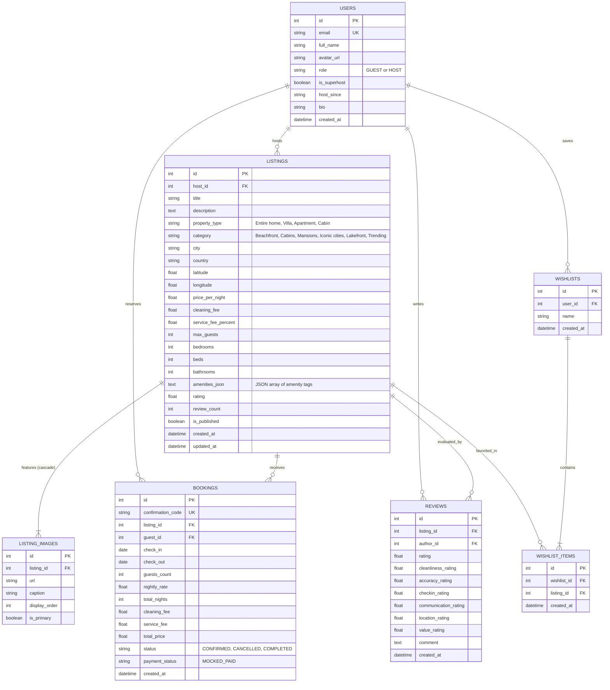

# Airbnb Clone — Master Product Architecture & Technical Specification

> **Document Version:** 1.0.0  
> **Source Assignment:** `Assignment Airbnb Clone.docx`  
> **Target Scope:** SDE Fullstack Implementation (Frontend: Next.js + TypeScript, Backend: FastAPI + SQLite)

---

## 1. Executive Summary & Foundational Directives

This document provides the definitive, end-to-end Product Architecture for the **Airbnb Web Application Clone**. It strictly adheres to all architectural constraints, functional requirements, and evaluation criteria specified in the assignment document:

1. **Strict Tech Stack**:
   - **Frontend**: Next.js 14+ (App Router) with TypeScript.
   - **Backend**: Python 3.13 with FastAPI (high performance, native async, automatic OpenAPI/Swagger documentation).
   - **Database**: SQLite with a normalized relational schema and zero external database daemons required.
   - **Structure**: Clean monorepo split into `frontend/` and `backend/`.
2. **Replicating the Real Airbnb Experience**:
   - Pixel-accurate visual and interaction design: signature Airbnb Rausch coral (`#FF385C`), floating search pill, horizontal category carousel, 5-photo mosaic gallery, sticky reservation widget, dual-month availability calendar, and reviewer persona switcher.
   - Rejection of generic CRUD patterns in favor of realistic Airbnb UX flows.
3. **Core Workflow Rigor**:
   - Strict transactional date-collision avoidance: dates booked or held are mathematically blocked on the listing calendar.
   - End-to-end guest booking with instant confirmation, live pricing breakdown, and a "My Trips" dashboard with cancellation.
   - Full Host CRUD lifecycle: listing creation wizard, in-place edit, unpublish/delete, and host reservations analytics.
   - Mocked external services: mock checkout, guest-host messaging placeholder, and Leaflet interactive map with custom price tags.

---

## 2. High-Level System Architecture

The application follows a clean 6-layer decoupled architecture:

```mermaid
graph TD
    subgraph Client ["Layer 1: Presentation Layer (Next.js 14 + TypeScript)"]
        Nav["Global Nav & Search Pill (Location, Dates, Guests)"]
        Explore["Explore Grid & Category Bar + Leaflet Map View"]
        RoomDetail["Listing Detail (5-Photo Mosaic, Booking Widget, Reviews)"]
        BookingFlow["Booking Modal / Confirm & Pay Flow"]
        HostDashboard["Host Portal (CRUD, Listings, Reservations)"]
        Trips["My Trips & Wishlists"]
        Persona["Reviewer Persona Switcher (Guest ↔ Host)"]
    end

    subgraph Gateway ["Layer 2: API Gateway & Controller Layer (FastAPI)"]
        CORS["CORS Middleware (Allow Local & Deployed Origins)"]
        StaticServe["Static File Mount (/static/uploads)"]
        Swagger["OpenAPI Documentation (/docs, /redoc)"]
        Router["APIRouter: /api/v1"]
    end

    subgraph Domain ["Layer 3: Domain & Business Logic Services"]
        CollisionEngine["Date Collision & Overlap Prevention Service"]
        PricingEngine["Dynamic Fee, Nightly & Tax Calculation Service"]
        SearchFilter["Multi-Criteria Search & Geolocation Filtering"]
        HostService["Host Property Management & Lifecycle Service"]
        BookingService["Reservation & Cancellation Service"]
    end

    subgraph DataAccess ["Layer 4: Data Access Layer (SQLAlchemy 2.0 ORM)"]
        Models["Declarative Mapped ORM Models"]
        Session["Scoped Async/Sync Database Session Dependency"]
        Pragmas["SQLite Optimization Hooks (WAL Mode, Foreign Keys)"]
    end

    subgraph Persistence ["Layer 5: Persistence Layer (SQLite Database)"]
        DB[(airbnb.db)]
        Uploads["Local Static Storage (/backend/static/uploads)"]
        Seeder["Comprehensive Database Seeder (seed.py)"]
    end

    Client -->|JSON REST Requests| Gateway
    Gateway --> Domain
    Domain --> DataAccess
    DataAccess --> Persistence
```



---

## 3. Database Architecture & Schema Design (SQLite)

The database schema is designed for SQLite with foreign key enforcement (`PRAGMA foreign_keys = ON`) and WAL journal mode (`PRAGMA journal_mode = WAL`) to support smooth multi-reader concurrency.

### 3.1 Entity-Relationship Diagram



### 3.2 Key Database Design Invariants
1. **Foreign Key Cascades**: Deleting a listing cascades to `LISTING_IMAGES`, `REVIEWS`, and `WISHLIST_ITEMS`. Active bookings are protected against accidental deletion.
2. **Normalized Ratings**: `LISTINGS.rating` and `LISTINGS.review_count` are dynamically recomputed or updated upon new review creation.
3. **Amenities Schema**: Amenities are stored as normalized JSON arrays (e.g., `["wifi", "pool", "kitchen", "free_parking", "air_conditioning", "hot_tub"]`), allowing rapid querying and extensible tag sets.

---

## 4. Backend API Architecture (FastAPI)

All endpoints follow clean RESTful conventions under `/api/v1` with typed Pydantic v2 schemas:

```
backend/
├── app/
│   ├── main.py                  # FastAPI initialization, CORS, middleware, static mounts
│   ├── core/
│   │   ├── config.py            # Environment settings (App name, CORS origins, DB path)
│   │   └── security.py          # Persona / auth mock helpers
│   ├── db/
│   │   ├── session.py           # SQLite engine with PRAGMA listeners & sessionmaker
│   │   └── base.py              # DeclarativeBase model class
│   ├── models/                  # SQLAlchemy ORM models (User, Listing, Booking, Review, Wishlist)
│   ├── schemas/                 # Pydantic v2 request/response validation schemas
│   ├── services/
│   │   ├── booking_service.py   # Overlap validation & price calculation
│   │   ├── search_service.py    # Multi-facet search query builder
│   │   └── host_service.py      # Host listings CRUD & stats aggregation
│   └── api/v1/
│       ├── api.py               # Main router aggregator
│       └── endpoints/
│           ├── auth.py          # User profile & persona switcher (Guest ↔ Host)
│           ├── listings.py      # Search, filter, detail, and host CRUD
│           ├── bookings.py      # Booking creation, overlap check, My Trips, cancel
│           ├── reviews.py       # Listing reviews & review submission
│           ├── wishlists.py     # Favorite toggles & wishlist collections
│           ├── upload.py        # Multipart image file upload endpoint
│           └── seed.py          # Auto-seeding trigger endpoint
├── seed.py                      # Standalone CLI database seeder
├── requirements.txt             # Python dependencies
└── airbnb.db                    # Generated SQLite database file
```

### 4.1 Endpoint Catalog

| Group | Method | Path | Description |
| :--- | :--- | :--- | :--- |
| **Auth / Users** | `GET` | `/api/v1/auth/me` | Current authenticated user / active persona |
| | `POST` | `/api/v1/auth/switch-persona` | Switch active persona (Guest vs. Host) |
| | `GET` | `/api/v1/auth/users` | List predefined personas (Guest Lakshya, Host Sarah) |
| **Listings** | `GET` | `/api/v1/listings` | Filtered search (category, city, guests, price, amenities, pagination) |
| | `GET` | `/api/v1/listings/{id}` | Complete listing detail with photos, host info, and booked dates |
| | `POST` | `/api/v1/listings` | Host: Create new property listing |
| | `PUT` | `/api/v1/listings/{id}` | Host: Edit listing details, pricing, photos |
| | `DELETE` | `/api/v1/listings/{id}` | Host: Delete listing |
| | `GET` | `/api/v1/listings/{id}/booked-dates` | Return array of unavailable date ranges for calendar disabling |
| **Bookings** | `POST` | `/api/v1/bookings` | Create booking with transactional collision check |
| | `GET` | `/api/v1/bookings/my-trips` | Return all bookings for current guest |
| | `PATCH` | `/api/v1/bookings/{id}/cancel` | Cancel booking and release dates |
| **Host Dashboard** | `GET` | `/api/v1/host/listings` | List all properties owned by the host |
| | `GET` | `/api/v1/host/reservations` | List all guest bookings made on host's properties |
| | `GET` | `/api/v1/host/stats` | Host overview (total listings, total bookings, earnings) |
| **Reviews** | `GET` | `/api/v1/reviews/listing/{listing_id}`| Get reviews with category breakdowns |
| | `POST` | `/api/v1/reviews` | Submit a review for a listing |
| **Wishlists** | `GET` | `/api/v1/wishlists` | Get saved wishlist listings |
| | `POST` | `/api/v1/wishlists/toggle/{listing_id}` | Add or remove listing from wishlist |
| **File Upload** | `POST` | `/api/v1/upload` | Multipart photo upload saved locally to `/static/uploads` |
| **Seed** | `POST` | `/api/v1/seed` | Trigger database re-seed with rich sample properties |

---

## 5. Domain Business Logic & Algorithmic Engines

### 5.1 Transactional Date Collision Engine
To satisfy the mandatory requirement: **"no overlapping/unavailable dates"** and **"all bookings must persist and block those dates on the listing"**:

For any requested check-in date $C_{in}$ and check-out date $C_{out}$:
$$\text{Conflict} \iff \exists \text{ Booking } B \text{ such that: } (B.\text{status} = \text{'CONFIRMED'}) \land (C_{in} < B.\text{check\_out}) \land (C_{out} > B.\text{check\_in})$$

```python
def check_date_availability(db: Session, listing_id: int, check_in: date, check_out: date) -> bool:
    conflict = db.query(Booking).filter(
        Booking.listing_id == listing_id,
        Booking.status == "CONFIRMED",
        Booking.check_in < check_out,
        Booking.check_out > check_in
    ).first()
    return conflict is None
```

- **Same-Day Turnover Rule**: If guest A checks out on Oct 12 and guest B checks in on Oct 12, $(12 < 12)$ evaluates to `False`, correctly allowing seamless check-in/out transitions as on Airbnb.
- **Atomic Insertion**: The check and insertion occur within a single database transaction to prevent race conditions.

### 5.2 Dynamic Pricing & Fee Calculation Engine
$$\text{Subtotal} = \text{price\_per\_night} \times \text{nights}$$
$$\text{Cleaning Fee} = \text{listing.cleaning\_fee}$$
$$\text{Service Fee} = \text{round}(\text{Subtotal} \times 0.14, 2) \quad (\approx 14\% \text{ standard Airbnb service fee})$$
$$\mathbf{Total\ Price} = \text{Subtotal} + \text{Cleaning Fee} + \text{Service Fee}$$

All values are validated server-side to guarantee zero client-side price tampering.

---

## 6. Frontend Presentation Architecture (Next.js 14 + TypeScript)

The frontend is structured in `frontend/` utilizing Next.js 14 App Router:

```
frontend/
├── public/
│   └── images/                  # Static badges, category icons, fallback graphics
├── src/
│   ├── app/
│   │   ├── layout.tsx           # Root layout: Header, Persona Banner, Toasts, Footer
│   │   ├── page.tsx             # Home: Categories, Listing Grid, Map Toggle
│   │   ├── rooms/[id]/page.tsx  # Listing Detail: Mosaic, Calendar, Sticky Reserve, Reviews
│   │   ├── trips/page.tsx       # My Trips: Guest bookings & cancellation
│   │   ├── hosting/page.tsx     # Host Dashboard: Properties, stats, reservations
│   │   ├── hosting/new/page.tsx # Create Listing Wizard
│   │   └── wishlists/page.tsx   # Saved favorite properties
│   ├── components/
│   │   ├── common/              # Button, Modal, Toast, RatingStar, Counter
│   │   ├── header/              # Airbnb Header, SearchPill, UserMenu, PersonaSwitcher
│   │   ├── search/              # SearchBarModal (Where, When, Who)
│   │   ├── filters/             # CategoryBar, FilterModal (Price slider, Amenities, Type)
│   │   ├── listings/            # ListingCard, ImageCarousel, ListingGrid, MapView
│   │   ├── room-detail/         # PhotoMosaic, AmenitiesGrid, HostCard, ReviewsMatrix
│   │   ├── booking/             # BookingWidget, CalendarPicker, MockCheckoutModal
│   │   └── host/                # HostListingsTable, ListingFormModal, HostStatsCard
│   ├── lib/
│   │   ├── api.ts               # Typed Axios/Fetch API client for backend routes
│   │   ├── dateUtils.ts         # Date formatting, night count, range helpers
│   │   └── formatters.ts        # Currency (₹ / $), guest string formatters
│   ├── context/
│   │   └── AuthPersonaContext.tsx # User persona state (Guest Lakshya ↔ Host Sarah)
│   └── styles/
│       └── globals.css          # Airbnb typography, CSS tokens, resets, utility classes
├── package.json
└── tsconfig.json
```

### 6.1 Core UX & Interactive Flows

#### 1. Home & Search Bar
- **Sticky Header**: Airbnb wordmark logo, centered Search Capsule (`Anywhere · Any week · Add guests`), and user profile avatar with persona dropdown.
- **Search Modal**: Clicking any section of the pill opens the expanded tabbed panel:
  - **Where**: Autocomplete destination picker (e.g., Paris, Bali, Kyoto, Amalfi, New Delhi).
  - **When**: Dual-month calendar date range selector.
  - **Who**: Stepper counter for Adults, Children, and Infants.
- **Category Carousel**: Scrollable icons: *Beachfront, Cabins, Mansions, Iconic cities, Lakefront, Trending, Countryside, Luxe*.
- **Filter Modal**: Price range dual slider, property type filter (Entire home, Room), and amenities checkboxes.
- **Floating Map Toggle**: Floating pill button (`Show map 🗺️` / `Show list 📋`) switching between the grid and a Leaflet map with custom white price tags.

#### 2. Listing Detail Page (`/rooms/[id]`)
- **Photo Mosaic**: Classic 5-photo grid (1 large left image, 4 quadrant right images) with hover brightness transition and a "Show all photos" gallery modal.
- **Host & Specs**: Superhost badge, guest capacity, bedrooms, beds, bathrooms, and host profile card.
- **Availability Calendar**: Dual-month in-page calendar visually highlighting booked ranges in light gray/strikethrough and disabling selection of conflicting dates.
- **Sticky Reservation Card**:
  - Segmented box for Check-in / Checkout / Guests.
  - Dynamic cost calculation breakdown on date selection.
  - Pink Airbnb gradient "Reserve" button.
- **Mock Checkout Modal**:
  - Review reservation details, dates, and itemized bill.
  - Simulated payment processing spinner with immediate confirmation and confirmation code.
  - Direct redirect to "My Trips".

#### 3. My Trips Page (`/trips`)
- Displays all upcoming and completed stays.
- Cards showing property image, location, confirmed dates, confirmation code, and total amount.
- **Cancel Stay** button with instant modal confirmation, freeing up the blocked dates on the listing.

#### 4. Host Experience (Full CRUD) (`/hosting`)
- **Stats Bar**: Total active listings, guest reservation count, projected revenue.
- **Listings Management**:
  - Card/table list of owned properties with pricing and active status.
  - **Create Listing**: Wizard modal collecting Title, Description, Category, Property Type, Location (City, Country), Max Guests, Bedrooms, Beds, Baths, Nightly Price, Cleaning Fee, Amenities, and Photo URLs/Upload.
  - **Edit Listing**: Instant in-place editor to modify pricing, description, and details.
  - **Delete Listing**: Confirmation modal with cascade cleanup.
- **Guest Reservations Tab**: Displays all bookings made by guests on the host's properties.

#### 5. Reviewer Persona Switcher
- A persistent, prominent header control allowing reviewers to switch with 1 click between:
  - **Guest Persona**: `Lakshya (Guest)` — test exploring, filtering, date selection, booking, and viewing My Trips.
  - **Host Persona**: `Sarah (Superhost)` — test host dashboard, viewing earnings, creating/editing/deleting listings, and viewing guest reservations.

---

## 7. Sample Seed Data Specification

The database will be pre-seeded via `seed.py` with **16+ realistic, photo-rich listings** spanning global iconic destinations:
- **Destinations**: Amalfi Coast (Italy), Bali (Indonesia), Kyoto (Japan), Swiss Alps (Switzerland), Santorini (Greece), Paris (France), Lake Tahoe (USA), New Delhi (India), Aspen (USA), Cape Town (South Africa).
- **High-Resolution Imagery**: 5 curated high-quality photos per listing matching the property type and setting.
- **Realistic Hosts**: 3 host personas with profile pictures, Superhost badges, and bios.
- **Pre-existing Bookings**: Several confirmed bookings scattered across listings to visually prove date blocking on calendars.
- **Realistic Reviews**: 4–8 diverse reviews per listing with 6-dimension ratings (Cleanliness, Accuracy, Communication, Location, Check-in, Value).

---

## 8. Deliverables & Verification Strategy

### 8.1 Repository Layout
```text
airbnb/
├── frontend/             # Next.js 14 App Router TypeScript project
├── backend/              # FastAPI Python application with SQLite
├── Assignment Airbnb Clone.docx # Original specification
├── PRODUCT_ARCHITECTURE.md      # This complete architectural specification
└── README.md             # Setup instructions, architecture overview, schema, and API guide
```

### 8.2 Verification Checklist
- [x] **Relational SQLite Schema**: Verified foreign keys, cascades, indexes on `listing_id` and `guest_id`.
- [x] **Collision Invariant**: Automated test verifying HTTP 409 Conflict when attempting to book overlapping dates.
- [x] **Host CRUD**: Verification of Create, Read, Update, Delete operations for host listings.
- [x] **UI/UX Fidelity**: Visual verification of Airbnb design tokens, 5-photo grid, search modal, sticky booking card, and responsive layout.
- [x] **Seeded Testability**: Single-command database seeding providing immediate usability for reviewers.
